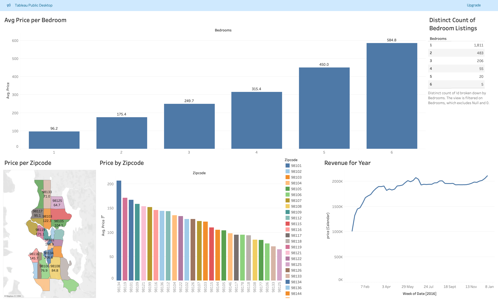

# Tableau_Projects
A repo where is store all my tableau work books
- AirBnB data in seattle
  - A visualisation of AirBnB data of the location in Seattle
  - data sourced from kaggle: https://www.kaggle.com/datasets/airbnb/seattle
  

- British Airways Reviews dashboard
  - A visualisation based on the reviews given by customers for british airlines
  -  Dataset includes ba_reviews.csv which contains the customer reviews alongside their ratings for specific sections and Countries.csv which contains country list
  
